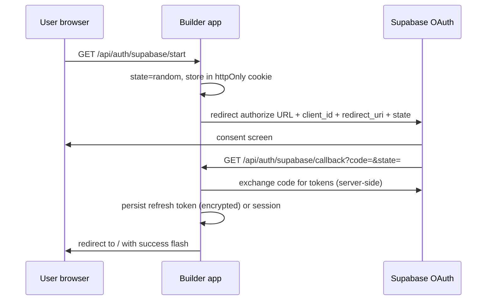

# Supabase OAuth for Builder (roadmap + skeleton)

This document outlines a **second-phase** integration: OAuth with Supabase so users do not paste anon keys manually. Phase 6a keeps the **wizard + pasted keys** path; Phase 6b adds optional OAuth.

## Goals

- User clicks **Connect with Supabase** → browser OAuth → app receives tokens.
- Generated previews continue using **CRA-style** env names (`REACT_APP_SUPABASE_URL`, `REACT_APP_SUPABASE_ANON_KEY`) so existing codegen prompts stay valid; the host injects values after OAuth the same way it does after manual save.

## Suggested flow

## Routes (skeleton in repo)

| Route | Purpose |
| --- | --- |
| `GET /api/auth/supabase/start` | Create `state`, set cookie, redirect to Supabase authorize URL |
| `GET /api/auth/supabase/callback` | Validate `state`, exchange `code`, store tokens, redirect home |

Current handlers return **501 Not Implemented** until env and legal review are done.

## Environment variables (host)

- `SUPABASE_OAUTH_CLIENT_ID`
- `SUPABASE_OAUTH_CLIENT_SECRET`
- `SUPABASE_OAUTH_REDIRECT_URI` (e.g. `https://your-domain.com/api/auth/supabase/callback`)

Configure the OAuth app in the Supabase dashboard (or linked identity provider) with the same redirect URI.

## Token storage (choose one)

1. **HttpOnly session cookie** — server holds refresh token; short-lived access token in memory for API calls. Best for same-site deployment on Vercel.
2. **Encrypted blob in existing persisted builder state** — possible but widens XSS blast radius; prefer server session.
3. **Supabase “personal access” style** — only if product scope allows; usually OAuth + refresh is enough to mint anon-compatible config for the project.

## Security notes

- Never forward **service role** keys to the browser or the LLM.
- `state` + PKCE (if supported) for CSRF protection.
- Rate-limit `start` and `callback`.

## Follow-up work

- Wire `start` redirect to real authorize URL.
- Implement token exchange and map to `BuilderIntegrations.supabase`.
- Optional: project picker API if OAuth returns account-level access only.
